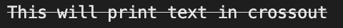

<!--yml
category: 未分类
date: 2024-10-13 06:41:36
-->

# Print/Output crossed-out text in Go (Golang)

> 来源：[https://golangbyexample.com/print-text-crossout-golang/](https://golangbyexample.com/print-text-crossout-golang/)

Table of Contents

 **   [Overview](#Overview "Overview")
*   [Program](#Program "Program")*  *# **Overview**

We can use the faith package to achieve the same

[https://github.com/fatih/color](https://github.com/fatih/color)

# **Program**

```
package main

import (
	"github.com/fatih/color"
)

func main() {
	whilte := color.New(color.FgWhite)
	boldWhite := whilte.Add(color.CrossedOut)
	boldWhite.Println("This will print text in crossout")
}
```

**Output**



**Note:** Check out our Golang Advanced Tutorial. The tutorials in this series are elaborative and we have tried to cover all concepts with examples. This tutorial is for those who are looking to gain expertise and a solid understanding of golang – [Golang Advance Tutorial](https://golangbyexample.com/golang-comprehensive-tutorial/)

Also if you are interested in understanding how all design patterns can be implemented in Golang. If yes, then this post is for you –[All Design Patterns Golang](https://golangbyexample.com/all-design-patterns-golang/)

*   [go](https://golangbyexample.com/tag/go/)*   [golang](https://golangbyexample.com/tag/golang/)*