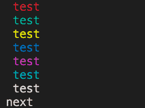

<!--yml
category: 未分类
date: 2024-10-13 06:15:59
-->

# Print/Output text in color in console

> 来源：[https://golangbyexample.com/print-output-text-color-console/](https://golangbyexample.com/print-output-text-color-console/)

**Note:** If you are interested in learning Golang, then for that we have a golang comprehensive tutorial series. Do check it out – [Golang Comprehensive Tutorial Series](https://golangbyexample.com/golang-comprehensive-tutorial/). Now let’s see the current tutorial. Below is the table of contents.

Table of Contents

 **   [Overview](#Overview "Overview")
*   [Code](#Code "Code")*  *# **Overview**

[ANSI escape codes](http://en.wikipedia.org/wiki/ANSI_escape_code) can be used to output colored text in console. Please note that

*   In MAC/Linux system terminal supports ANSI escape codes

*   Windows Command Prompt doesn’t support it. On windows you can install Cygwin. ANSI escape codes work on that.

Also to mention in the below code we have used colorReset after printing. If we don’t use that then the color effect remains and it is not cleared. Remove the colorReset from below code and it will show text “**next”** in cyan color
Below is code in golang to do the same.

# **Code**

```
package main

import (
    "fmt"
)

func main() {
    colorReset := "\033[0m"

    colorRed := "\033[31m"
    colorGreen := "\033[32m"
    colorYellow := "\033[33m"
    colorBlue := "\033[34m"
    colorPurple := "\033[35m"
    colorCyan := "\033[36m"
    colorWhite := "\033[37m"

    fmt.Println(string(colorRed), "test")
    fmt.Println(string(colorGreen), "test")
    fmt.Println(string(colorYellow), "test")
    fmt.Println(string(colorBlue), "test")
    fmt.Println(string(colorPurple), "test")
    fmt.Println(string(colorWhite), "test")
    fmt.Println(string(colorCyan), "test", string(colorReset))
    fmt.Println("next")
}
```

**Output:**

On my mac machine

*   [ansi](https://golangbyexample.com/tag/ansi/)*   [color](https://golangbyexample.com/tag/color/)*   [console](https://golangbyexample.com/tag/console/)*   [go](https://golangbyexample.com/tag/go/)*   [output](https://golangbyexample.com/tag/output/)*   [print](https://golangbyexample.com/tag/print/)*   [terminal](https://golangbyexample.com/tag/terminal/)*   [text](https://golangbyexample.com/tag/text/)*