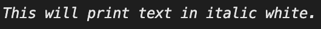

<!--yml
category: 未分类
date: 2024-10-13 06:41:24
-->

# Print/Output text in italic in Go (Golang)

> 来源：[https://golangbyexample.com/print-italic-text-golang/](https://golangbyexample.com/print-italic-text-golang/)

Table of Contents

 **   [Overview](#Overview "Overview")
*   [Program](#Program "Program")*  *# **Overview**

We can use the faith package to achieve the same

[https://github.com/fatih/color](https://github.com/fatih/color)

# **Program**

```
package main

import (
	"fmt"

	"github.com/fatih/color"
)

func main() {
	whilte := color.New(color.FgWhite)
	boldWhite := whilte.Add(color.Italic)
	boldWhite.Println("This will print text in italic white.")
}
```

**Output**

*   [go](https://golangbyexample.com/tag/go/)*   [golang](https://golangbyexample.com/tag/golang/)*