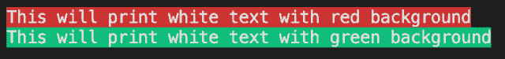

<!--yml
category: 未分类
date: 2024-10-13 06:41:30
-->

# Print/Output text with a background in Go (Golang)

> 来源：[https://golangbyexample.com/print-text-background-golang/](https://golangbyexample.com/print-text-background-golang/)

Table of Contents

 **   [Overview](#Overview "Overview")
*   [Program](#Program "Program")*  *# **Overview**

We can use the faith package to achieve the same

[https://github.com/fatih/color](https://github.com/fatih/color)

# **Program**

In the below program we are printing a text in white with red background

```
package main

import (
	"fmt"

	"github.com/fatih/color"
)

func main() {
	whilte := color.New(color.FgWhite)
	boldWhite := whilte.Add(color.BgRed)
	boldWhite.Print("This will print white text with red background")
	fmt.Println()

	boldWhite = whilte.Add(color.BgGreen)
	boldWhite.Print("This will print white text with green background")
	fmt.Println()

}
```

**Output**



Other background color options are

[https://github.com/fatih/color/blob/master/color.go](https://github.com/fatih/color/blob/master/color.go)

```
// Background text colors
const (
    BgBlack Attribute = iota + 40
    BgRed
    BgGreen
    BgYellow
    BgBlue
    BgMagenta
    BgCyan
    BgWhite
)
// Background Hi-Intensity text colors
const (
    BgHiBlack Attribute = iota + 100
    BgHiRed
    BgHiGreen
    BgHiYellow
    BgHiBlue
    BgHiMagenta
    BgHiCyan
    BgHiWhite
)
```

**Note:** Check out our Golang Advanced Tutorial. The tutorials in this series are elaborative and we have tried to cover all concepts with examples. This tutorial is for those who are looking to gain expertise and a solid understanding of golang – [Golang Advance Tutorial](https://golangbyexample.com/golang-comprehensive-tutorial/)

Also if you are interested in understanding how all design patterns can be implemented in Golang. If yes, then this post is for you –[All Design Patterns Golang](https://golangbyexample.com/all-design-patterns-golang/)

*   [go](https://golangbyexample.com/tag/go/)*   [golang](https://golangbyexample.com/tag/golang/)*