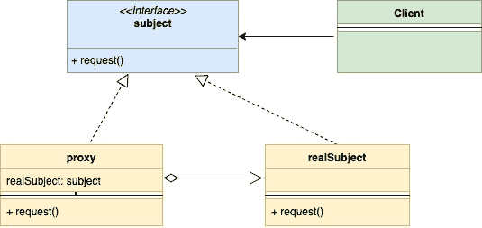

<!--yml
category: 未分类
date: 2024-10-13 06:03:09
-->

# Proxy Design Pattern in Go (Golang)

> 来源：[https://golangbyexample.com/proxy-design-pattern-in-golang/](https://golangbyexample.com/proxy-design-pattern-in-golang/)

Note: Interested in understanding how all other design patterns can be implemented in GO. Please see this full reference – [All Design Patterns in Go (Golang)](https://golangbyexample.com/all-design-patterns-golang/)

Table of Contents

 **   [Introduction: ](#Introduction "Introduction: ")
*   [UML Diagram:](#UML_Diagram "UML Diagram:")
*   [Mapping ](#Mapping "Mapping ")
*   [Practical Example:](#Practical_Example "Practical Example:")
*   [Full Working Code:](#Full_Working_Code "Full Working Code:")*  *## **Introduction: **

Proxy Design Pattern is a structural design pattern. This pattern suggests providing an extra layer of indirection for controlled and intelligent access to the main object.

In this pattern, a new proxy class is created that implements the same interface as the main object. This lets you execute some behavior before the actual logic of the main object. Let’s understand it more with an example

1.  A debit card is a proxy for your bank account. It follows the same interface as the bank account, and it is easier to use.
2.  A web server such as Nginx can act as a proxy for your application server. It provides
    *   Controlled access to your application server – For example, it can do rate limiting
    *   Additional behavior – For example, it can do some caching

Let’ss see the UML Diagram

## **UML Diagram:**

In below UML diagram

*   **Subject:** it represents the interface which proxy and the realSubject should follow
*   **Proxy**: The proxy class embeds the realSubject and passes on the request to the realSubject after it has finished its processing
*   **RealSubject**: This is the class that holds the main business logic and which is kept behind a proxy
*   **Client:** Can interact with both proxy and realSubject as they both follow the same interface.

*   

Below is the corresponding mapping UML diagram with the practical example of nginx and application server which was described above.

*   

## **Mapping **

The below table represents the mapping from the UML diagram actors to actual implementation actors in code

| subject | server.go |
| proxy | nginx.go |
| realSubject | application.go |
| client | main.go |

## **Practical Example:**

**server.go**

```
package main

type server interface {
    handleRequest(string, string) (int, string)
}
```

**nginx.go**

```
package main

type nginx struct {
    application       *application
    maxAllowedRequest int
    rateLimiter       map[string]int
}

func newNginxServer() *nginx {
    return &nginx{
        application:       &application{},
        maxAllowedRequest: 2,
        rateLimiter:       make(map[string]int),
    }
}

func (n *nginx) handleRequest(url, method string) (int, string) {
    allowed := n.checkRateLimiting(url)
    if !allowed {
        return 403, "Not Allowed"
    }
    return n.application.handleRequest(url, method)
}

func (n *nginx) checkRateLimiting(url string) bool {
    if n.rateLimiter[url] == 0 {
        n.rateLimiter[url] = 1
    }
    if n.rateLimiter[url] > n.maxAllowedRequest {
        return false
    }
    n.rateLimiter[url] = n.rateLimiter[url] + 1
    return true
}
```

**application.go**

```
package main

type application struct {
}

func (a *application) handleRequest(url, method string) (int, string) {
    if url == "/app/status" && method == "GET" {
        return 200, "Ok"
    }
    if url == "/create/user" && method == "POST" {
        return 201, "User Created"
    }
    return 404, "Not Ok"
}
```

**main.go**

```
package main

import "fmt"

func main() {
    nginxServer := newNginxServer()
    appStatusURL := "/app/status"
    createuserURL := "/create/user"
    httpCode, body := nginxServer.handleRequest(appStatusURL, "GET")
    fmt.Printf("\nUrl: %s\nHttpCode: %d\nBody: %s\n", appStatusURL, httpCode, body)
    httpCode, body = nginxServer.handleRequest(appStatusURL, "GET")
    fmt.Printf("\nUrl: %s\nHttpCode: %d\nBody: %s\n", appStatusURL, httpCode, body)
    httpCode, body = nginxServer.handleRequest(appStatusURL, "GET")
    fmt.Printf("\nUrl: %s\nHttpCode: %d\nBody: %s\n", appStatusURL, httpCode, body)
    httpCode, body = nginxServer.handleRequest(createuserURL, "POST")
    fmt.Printf("\nUrl: %s\nHttpCode: %d\nBody: %s\n", appStatusURL, httpCode, body)
    httpCode, body = nginxServer.handleRequest(createuserURL, "GET")
    fmt.Printf("\nUrl: %s\nHttpCode: %d\nBody: %s\n", appStatusURL, httpCode, body)
}
```

**Output:**

```
Url: /app/status
HttpCode: 200
Body: Ok

Url: /app/status
HttpCode: 200
Body: Ok

Url: /app/status
HttpCode: 403
Body: Not Allowed

Url: /app/status
HttpCode: 201
Body: User Created

Url: /app/status
HttpCode: 404
Body: Not Ok
```

## **Full Working Code:**

```
package main

import "fmt"

type server interface {
    handleRequest(string, string) (int, string)
}

type nginx struct {
    application       *application
    maxAllowedRequest int
    rateLimiter       map[string]int
}

func newNginxServer() *nginx {
    return &nginx{
        application:       &application{},
        maxAllowedRequest: 2,
        rateLimiter:       make(map[string]int),
    }
}

func (n *nginx) handleRequest(url, method string) (int, string) {
    allowed := n.checkRateLimiting(url)
    if !allowed {
        return 403, "Not Allowed"
    }
    return n.application.handleRequest(url, method)
}

func (n *nginx) checkRateLimiting(url string) bool {
    if n.rateLimiter[url] == 0 {
        n.rateLimiter[url] = 1
    }
    if n.rateLimiter[url] > n.maxAllowedRequest {
        return false
    }
    n.rateLimiter[url] = n.rateLimiter[url] + 1
    return true
}

type application struct {
}

func (a *application) handleRequest(url, method string) (int, string) {
    if url == "/app/status" && method == "GET" {
        return 200, "Ok"
    }
    if url == "/create/user" && method == "POST" {
        return 201, "User Created"
    }
    return 404, "Not Ok"
}

func main() {
    nginxServer := newNginxServer()
    appStatusURL := "/app/status"
    createuserURL := "/create/user"
    httpCode, body := nginxServer.handleRequest(appStatusURL, "GET")
    fmt.Printf("\nUrl: %s\nHttpCode: %d\nBody: %s\n", appStatusURL, httpCode, body)
    httpCode, body = nginxServer.handleRequest(appStatusURL, "GET")
    fmt.Printf("\nUrl: %s\nHttpCode: %d\nBody: %s\n", appStatusURL, httpCode, body)
    httpCode, body = nginxServer.handleRequest(appStatusURL, "GET")
    fmt.Printf("\nUrl: %s\nHttpCode: %d\nBody: %s\n", appStatusURL, httpCode, body)
    httpCode, body = nginxServer.handleRequest(createuserURL, "POST")
    fmt.Printf("\nUrl: %s\nHttpCode: %d\nBody: %s\n", appStatusURL, httpCode, body)
    httpCode, body = nginxServer.handleRequest(createuserURL, "GET")
    fmt.Printf("\nUrl: %s\nHttpCode: %d\nBody: %s\n", appStatusURL, httpCode, body)
}
```

**Output:**

```
Url: /app/status
HttpCode: 200
Body: Ok

Url: /app/status
HttpCode: 200
Body: Ok

Url: /app/status
HttpCode: 403
Body: Not Allowed

Url: /app/status
HttpCode: 201
Body: User Created

Url: /app/status
HttpCode: 404
Body: Not Ok
```

*   [design pattern](https://golangbyexample.com/tag/design-pattern/)*   [go](https://golangbyexample.com/tag/go/)*   [golang](https://golangbyexample.com/tag/golang/)*   [proxy design pattern](https://golangbyexample.com/tag/proxy-design-pattern/)*