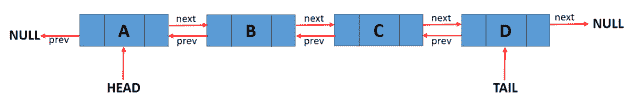
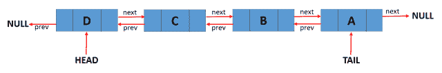

<!--yml
category: 未分类
date: 2024-10-13 06:38:03
-->

# Reverse Doubly Linked List in Go (Golang)

> 来源：[https://golangbyexample.com/reverse-doubly-linked-list-golang/](https://golangbyexample.com/reverse-doubly-linked-list-golang/)

Table of Contents

 **   [Overview](#Overview "Overview")
*   [Program](#Program "Program")*  *## **Overview**

A Doubly Linked List can be reversed by below two methods:

*   By swapping previous and next pointers of nodes.

*   By using stack

In this tutorial, we will cover the first method i.e by swapping previous and next pointers.

Let’s say we have below doubly linked list



After reversing, a doubly-linked list will be like below:



## **Program**

In this approach we need to take care of the below points:

*   Swap head and tail of the doubly linked list

*   Swap previous and next pointers of all nodes

```
package main
import "fmt"
type node struct {
    data string
    prev *node
    next *node
}
type doublyLinkedList struct {
    len  int
    tail *node
    head *node
}
func initDoublyList() *doublyLinkedList {
    return &doublyLinkedList{}
}
func (d *doublyLinkedList) AddFrontNodeDLL(data string) {
    newNode := &node{
        data: data,
    }
    if d.head == nil {
        d.head = newNode
        d.tail = newNode
    } else {
        newNode.next = d.head
        d.head.prev = newNode
        d.head = newNode
    }
    d.len++
}
func (d *doublyLinkedList) AddEndNodeDLL(data string) {
    newNode := &node{
        data: data,
    }
    if d.head == nil {
        d.head = newNode
        d.tail = newNode
    } else {
        currentNode := d.head
        for currentNode.next != nil {
            currentNode = currentNode.next
        }
        newNode.prev = currentNode
        currentNode.next = newNode
        d.tail = newNode
    }
    d.len++
}
func (d *doublyLinkedList) TraverseForward() error {
    if d.head == nil {
        return fmt.Errorf("TraverseError: List is empty")
    }
    temp := d.head
    for temp != nil {
        fmt.Printf("value = %v, prev = %v, next = %v\n", temp.data, temp.prev, temp.next)
        temp = temp.next
    }
    fmt.Println()
    return nil
}
func (d *doublyLinkedList) Size() int {
    return d.len
}
func (d *doublyLinkedList) ReverseDLL() {
    currentNode := d.head
    var nextInList *node
    d.head, d.tail = d.tail, d.head
    for currentNode != nil {
        nextInList = currentNode.next
        currentNode.next, currentNode.prev = currentNode.prev, currentNode.next
        currentNode = nextInList
    }
}
func main() {
    doublyList := initDoublyList()
    fmt.Printf("Add Front Node: C\n")
    doublyList.AddFrontNodeDLL("C")
    fmt.Printf("Add Front Node: B\n")
    doublyList.AddFrontNodeDLL("B")
    fmt.Printf("Add Front Node: A\n")
    doublyList.AddFrontNodeDLL("A")
    fmt.Printf("Add End Node: D\n")
    doublyList.AddEndNodeDLL("D")
    fmt.Printf("Add End Node: E\n")
    doublyList.AddEndNodeDLL("E")
    fmt.Printf("Size of doubly linked ist: %d\n", doublyList.Size())
    err := doublyList.TraverseForward()
    if err != nil {
        fmt.Println(err.Error())
    }
    fmt.Println("Reversing Doubly Linked List")
    doublyList.ReverseDLL()
    fmt.Printf("Size of doubly linked ist: %d\n", doublyList.Size())
    err = doublyList.TraverseForward()
    if err != nil {
        fmt.Println(err.Error())
    }
}
```

**Output**

```
Add Front Node: C
Add Front Node: B
Add Front Node: A
Add End Node: D
Add End Node: E
Size of doubly linked ist: 5
value = A, prev = <nil>, next = &{B 0xc000070060 0xc000070020}
value = B, prev = &{A <nil>0xc000070040}, next = &{C 0xc000070040 0xc000070080}
value = C, prev = &{B 0xc000070060 0xc000070020}, next = &{D 0xc000070020 0xc0000700a0}
value = D, prev = &{C 0xc000070040 0xc000070080}, next = &{E 0xc000070080 <nil>}
value = E, prev = &{D 0xc000070020 0xc0000700a0}, next = <nil>Reversing Doubly Linked List
Size of doubly linked ist: 5
value = E, prev = <nil>, next = &{D 0xc0000700a0 0xc000070020}
value = D, prev = &{E <nil>0xc000070080}, next = &{C 0xc000070080 0xc000070040}
value = C, prev = &{D 0xc0000700a0 0xc000070020}, next = &{B 0xc000070020 0xc000070060}
value = B, prev = &{C 0xc000070080 0xc000070040}, next = &{A 0xc000070040 <nil>}
value = A, prev = &{B 0xc000070020 0xc000070060}, next =</nil></nil></nil></nil></nil></nil></nil> 
```

Also, check out our Golang advance tutorial Series – [Golang Advance Tutorial](https://golangbyexample.com/golang-comprehensive-tutorial/)

*   [go](https://golangbyexample.com/tag/go/)*   [golang](https://golangbyexample.com/tag/golang/)*