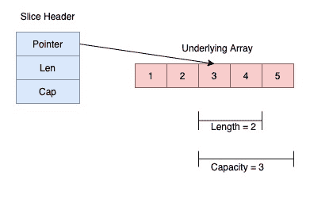

<!--yml
category: 未分类
date: 2024-10-13 06:19:00
-->

# Slice in Go (Golang)

> 来源：[https://golangbyexample.com/slice-in-golang/](https://golangbyexample.com/slice-in-golang/)

This is the  chapter 18 of the golang comprehensive tutorial series. Refer to this link for other chapters of the series – [Golang Comprehensive Tutorial Series](https://golangbyexample.com/golang-comprehensive-tutorial/)

**Next Tutorial** – [Maps](https://golangbyexample.com/maps-in-golang)
**Previous Tutorial** – [Array](https://golangbyexample.com/understanding-array-golang-complete-guid)

Now let’s check out the current tutorial. Below is the table of contents for current tutorial.

Table of Contents

 **   [Overview](#Overview "Overview")
*   [Creating a slice](#Creating_a_slice "Creating a slice")
    *   [Using the []<type>{} format](#Using_the_format "Using the []<type>{} format")
    *   [Creating a slice from another slice or array](#Creating_a_slice_from_another_slice_or_array "Creating a slice from another slice or array")
        *   [Create a slice from Array](#Create_a_slice_from_Array "Create a slice from Array")
        *   [Create a slice from slice](#Create_a_slice_from_slice "Create a slice from slice")
    *   [Using the make function](#Using_the_make_function "Using the make function")
    *   [Using the new function](#Using_the_new_function "Using the new function")
*   [Length vs Capacity](#Length_vs_Capacity "Length vs Capacity")
*   [Accessing and Modifying Slice Elements](#Accessing_and_Modifying_Slice_Elements "Accessing and Modifying Slice Elements")
*   [Different ways of iterating a slice](#Different_ways_of_iterating_a_slice "Different ways of iterating a slice")
*   [Appending to a slice](#Appending_to_a_slice "Appending to a slice")
*   [Copy a slice](#Copy_a_slice "Copy a slice")
*   [Nil Slice](#Nil_Slice "Nil Slice")
*   [Multidimensional Slices](#Multidimensional_Slices "Multidimensional Slices")
*   [Conclusion](#Conclusion "Conclusion")*  *# **Overview**

The size of the array being part of it limits the expressiveness and power of array in go. This is where slice comes into the picture. Slice is more powerful and convenient to use than an array.  Slice, in fact, is more analogous to arrays in another programming language.

A slice points to an underlying array and is internally represented by a slice header.  Unlike array, the size of a slice is flexible and can be changed.

**Internal representation of a slice**

Internally a slice is represented by three things.

*   Pointer to the underlying array
*   Current length of the underlying array
*   Total Capacity which is the maximum capacity to which the underlying array can expand.

Above internal representation is described by **SliceHeader** struct which looks like this:

```
type SliceHeader struct {
        Pointer uintptr
        Len  int
        Cap  int
}
```

The **Pointer** field in the slice header is a pointer to the underlying array.  Len is the current length of the slice and Cap is the capacity of the slice. Similar to array a slice index starts from **zero** till **length_of_slice-1**. So a slice of 3 lengths and 5 capacity will look like below


# ****Creating** a slice**

There are four ways of creating a slice

*   Using the []<type>{} format

*   Creating a slice from another slice or array

*   Using make

*   Using new

Let’s look at each of above method one by one.

## **Using the []<type>{} format**

The most common way of declaring a slice is this

```
s := []int
```

It declares an empty of slice of 0 length and 0 capacity. We can also initialise the slice during declaration.

```
s := []int{1,2}
```

It declares a slice of integers of length 2 and also the capacity of 2\. The capacity will be equal to the actual slice elements specified. We also have two library functions provided by go which can be used to know the **length** and **capacity** of a slice.

*   **len()** function – for  length of the slice

*   **cap()** function – for capacity of the slice

Let’s see a small program which shows the above points

```
package main

import "fmt"

func main() {
    sample := []int{}
    fmt.Println(len(sample))
    fmt.Println(cap(sample))
    fmt.Println(sample)

    letters := []string{"a", "b", "c"}
    fmt.Println(len(letters))
    fmt.Println(cap(letters))
    fmt.Println(letters)
}
```

**Output**

```
0
0
[]

3
3
[a b c]
```

When the actual elements are not specified, then both length and capacity of the slice is zero. When actual elements are specified , both length and capacity is equal to the number of actual elements specified.

## **Creating a slice from another slice or array**

A slice can be created by re-slicing an exiting slice or array.

### **Create a slice from Array**

The format for creating a new slice by re-slicing an existing array is

```
[n]sample[start:end]
```

The above operation will return a new slice from the arraystarting from index **start** to index **end-1\.** So the element at index **end** is not included in the newly created slice. While re-slicing , both start and end index is optional.

*   The default value of the start index is zero

*   The default value of the end index is the length of the array

Let’s see an example.

```
package main

import "fmt"

func main() {
    numbers := [5]int{1, 2, 3, 4, 5}

    //Both start and end
    num1 := numbers[2:4]
    fmt.Println("Both start and end")
    fmt.Printf("num1=%v\n", num1)
    fmt.Printf("length=%d\n", len(num1))
    fmt.Printf("capacity=%d\n", cap(num1))

    //Only start
    num2 := numbers[2:]
    fmt.Println("\nOnly start")
    fmt.Printf("num1=%v\n", num2)
    fmt.Printf("length=%d\n", len(num2))
    fmt.Printf("capacity=%d\n", cap(num2))

    //Only end
    num3 := numbers[:3]
    fmt.Println("\nOnly end")
    fmt.Printf("num1=%v\n", num3)
    fmt.Printf("length=%d\n", len(num3))
    fmt.Printf("capacity=%d\n", cap(num3))

    //None
    num4 := numbers[:]
    fmt.Println("\nOnly end")
    fmt.Printf("num1=%v\n", num4)
    fmt.Printf("length=%d\n", len(num4))
    fmt.Printf("capacity=%d\n", cap(num4))
}
```

**Output**

```
Both start and end
num1=[3 4]
length=2
capacity=3

Only start
num1=[3 4 5]
length=3
capacity=3

Only end
num1=[1 2 3]
length=3
capacity=5

Only end
num1=[1 2 3 4 5]
length=5
capacity=5
```

Notice in above example that

*   length of newly created slice = (**end**–**start**)

*   capacity of newly created slice = (**length_of_array**–**start**)

The **num1** slice would look like



The newly created slices still refer the original array. To check this change element at any one of the index of the array and then reprint the slice

```
numbers[3] = 8
fmt.Printf("num1=%v\n", num2)
fmt.Printf("num3=%v\n", num3)
fmt.Printf("num4=%v\n", num4)
```

Here is the output:

```
num1=[3 8 5]
num3=[1 2 3 8]
num4=[1 2 3 8 5]
```

This proves that each of the new slice is still referring to the original array.

### **Create a slice from slice**

Whatever we discussed about re-slicing from an array also applies here as well. See below example which illustrates same thing

```
package main

import "fmt"

func main() {
    numbers := []int{1, 2, 3, 4, 5}

    //Both start and end
    num1 := numbers[2:4]
    fmt.Println("Both start and end")
    fmt.Printf("num1=%v\n", num1)
    fmt.Printf("length=%d\n", len(num1))
    fmt.Printf("capacity=%d\n", cap(num1))

    //Only start
    num2 := numbers[2:]
    fmt.Println("\nOnly start")
    fmt.Printf("num1=%v\n", num2)
    fmt.Printf("length=%d\n", len(num2))
    fmt.Printf("capacity=%d\n", cap(num2))

    //Only end
    num3 := numbers[:3]
    fmt.Println("\nOnly end")
    fmt.Printf("num1=%v\n", num3)
    fmt.Printf("length=%d\n", len(num3))
    fmt.Printf("capacity=%d\n", cap(num3))

    //None
    num4 := numbers[:]
    fmt.Println("\nOnly end")
    fmt.Printf("num1=%v\n", num4)
    fmt.Printf("length=%d\n", len(num4))
    fmt.Printf("capacity=%d\n", cap(num4))
}
```

**Output**

```
Both start and end
num1=[3 4]
length=2
capacity=3

Only start
num1=[3 4 5]
length=3
capacity=3

Only end
num1=[1 2 3]
length=3
capacity=5

Only end
num1=[1 2 3 4 5]
length=5
capacity=5
```

Here also the newly created slices refer to the same underlying array that was being referred to by the original slice.  To check this change element at any one of the index of the original slice and then reprint all the newly created slices

```
numbers[3] = 8
fmt.Printf("num1=%v\n", num2)
fmt.Printf("num3=%v\n", num3)
fmt.Printf("num4=%v\n", num4)
```

Here is the output:

```
num1=[3 8 5]
num3=[1 2 3 8]
num4=[1 2 3 8 5]
```

## **Using the make function**

**make** is a builtin function provided by go that can also be used to create a slice. Below is the signature of make function

```
func make([]{type}, length, capacity int) []{type}
```

Capacity is an optional parameter while creating slice using the make function. When capacity is omitted, the capacity of the slice is equal length specified for the slice. When using make function, behind the scenes go allocates an array equal to the capacity. All the elements of the allocated array are initialized with default zero value of the type. Let’s see a program illustrating this point.

```
package main

import "fmt"

func main() {
    numbers := make([]int, 3, 5)
    fmt.Printf("numbers=%v\n", numbers)
    fmt.Printf("length=%d\n", len(numbers))
    fmt.Printf("capacity=%d\n", cap(numbers))

    //With capacity ommited
    numbers = make([]int, 3)
    fmt.Println("\nCapacity Ommited")
    fmt.Printf("numbers=%v\n", numbers)
    fmt.Printf("length=%d\n", len(numbers))
    fmt.Printf("capacity=%d\n", cap(numbers))
}
```

**Output**

```
numbers=[0 0 0]
length=3
capacity=5

Capacity Ommited
numbers=[0 0 0]
length=3
capacity=3
```

## **Using the new function**

**new** is a builtin function provided by go that can also be used to create a slice. It is not a very popular way of creating a slice as **make** is much more flexible in terms of functionalities . It is not generally used and also using **new** function returns a pointer to nil slice. Let’s see an example. In below example we are using the dereferencing operator **‘*’** as **new** function returns a pointer to the nil slice.

```
package main

import "fmt"

func main() {
    numbers := new([]int)
    fmt.Printf("numbers=%v\n", *numbers)
    fmt.Printf("length=%d\n", len(*numbers))
    fmt.Printf("capacity=%d\n", cap(*numbers))
}
```

**Output**

```
numbers=[]
length=0
capacity=0
```

# **Length vs Capacity**

Before moving further, let’s emphasis on understanding the caveats of length and capacity. Let’s create a simple slice with capacity greater than length.

```
numbers := make([]int, 3, 5)
```

*   Accessing the slice behind its length will result in a run time error “Index out of range”. It doesn’t matter if the accessed index is within the capacity. So the below line will cause the run time error.

```
numbers[4] = 5
```

*   The length of the slice can be increased up to its capacity by re-slicing. So below re-slice will increase the length from 3 to 5.

```
numbers = numbers[0:5]
```

*   The length of the slice can also be decreased using re-slicing. So below re-slice will decrease the length from 3 to 2

```
numbers = numbers[0:2]
```

*   The advantage of having capacity is that array of size capacity can be pre-allocated during the initialization.  This is a performance boost as if more elements are needed to include in this array then space is already allocated for them.

Let’s see the program illustrating above points

```
package main

import "fmt"

func main() {
    numbers := make([]int, 3, 5)
    fmt.Printf("numbers=%v\n", numbers)
    fmt.Printf("length=%d\n", len(numbers))
    fmt.Printf("capacity=%d\n", cap(numbers))

    //This line will cause a runtime error index out of range [4] with length 3
    //numbers[4] = 5

    //Increasing the length from 3 to 5
    numbers = numbers[0:5]
    fmt.Println("\nIncreasing length from 3 to 5")
    fmt.Printf("numbers=%v\n", numbers)
    fmt.Printf("length=%d\n", len(numbers))
    fmt.Printf("capacity=%d\n", cap(numbers))

    //Decresing the length from 3 to 2
    numbers = numbers[0:2]
    fmt.Println("\nDecreasing length from 3 to 2")
    fmt.Printf("numbers=%v\n", numbers)
    fmt.Printf("length=%d\n", len(numbers))
    fmt.Printf("capacity=%d\n", cap(numbers))
}
```

**Output**

```
numbers=[0 0 0]
length=3
capacity=5

Increasing length from 3 to 5
numbers=[0 0 0 0 0]
length=5
capacity=5

Decreasing length from 3 to 2
numbers=[0 0]
length=2
capacity=5
```

# **Accessing and Modifying Slice Elements**

A slice element can be accessed by specifying the index. Slice element can also be allotted a new value using the index. Also, note that any changes in the underlying array will reflect back in the slice as we have also seen above. Let’s see a small example of accessing and modifying

```
package main

import "fmt"

func main() {
    array := [5]int{1, 2, 3, 4, 5}
    slice := array[:]

    //Modifying the slice
    slice[1] = 7
    fmt.Println("Modifying Slice")
    fmt.Printf("Array=%v\n", array)
    fmt.Printf("Slice=%v\n", slice)

    //Modifying the array. Would reflect back in slice too
    array[1] = 2
    fmt.Println("\nModifying Underlying Array")
    fmt.Printf("Array=%v\n", array)
    fmt.Printf("Slice=%v\n", slice)
}
```

**Output**

```
Modifying Slice
Array=[1 7 3 4 5]
Slice=[1 7 3 4 5]

Modifying Underlying Array
Array=[1 2 3 4 5]
Slice=[1 2 3 4 5]
```

# **Different ways of iterating a slice**

An array can be iterated using:

*   Using for loop

*   Using for-range loop

Let’s see a code example for both

```
package main

import "fmt"

func main() {
    letters := []string{"a", "b", "c"}
    //Using for loop
    fmt.Println("Using for loop")
    len := len(letters)
    for i := 0; i < len; i++ {
        fmt.Println(letters[i])
    }

    //Using for-range operator
    fmt.Println("\nUsing for-range loop")
    for i, letter := range letters {
        fmt.Printf("%d %s\n", i, letter)
    }
}
```

**Output**

```
Using for loop
a
b
c

Using for-range loop
0 a
1 b
2 c
```

# **Appending to a slice**

go **builtin** package provides an **append** function that can be used to append to a slice at the end. Below is the signature of this function

```
func append(slice []Type, elems ...Type) []Type
```

The first argument is the slice itself. The second is the variable number of arguments which is

```
elems ...Type
```

**'...'** operator is the variadic syntax. So basically **...Type** means It means that the append function can accept variable number of arguments of type **Type**. Below is the way for using this function. In below code we are appending 4 to a slice which has two elements. It appends at the end and returns the original slice. That is why we are collecting result again in **numbers** variable. It is also ok to assign the result to some other variable.

```
numbers := []int{1,2}
numbers = append(numbers, 4) //Slice will become [1, 2, 4]
```

It is also ok to append many number of elements because the second argument is the variadic argument.

```
numbers := []int{1,2}
numbers = append(numbers, 3, 4, 5) //Slice will become [1, 2, 3, 4, 5]
```

This function in the background increases the length and capacity of the slice. There are two cases

*   When slice length is less than capacity.

In this case, on using the append function,  the length of the slice will be increased  by one without any change in its capacity. Let's see a example

```
package main

import "fmt"

func main() {
    numbers := make([]int, 3, 5)
    numbers[0] = 1
    numbers[1] = 2
    numbers[2] = 3
    fmt.Printf("numbers=%v\n", numbers)
    fmt.Printf("length=%d\n", len(numbers))
    fmt.Printf("capacity=%d\n", cap(numbers))

    //Append number 4
    numbers = append(numbers, 4)
    fmt.Println("\nAppend Number 4")
    fmt.Printf("numbers=%v\n", numbers)
    fmt.Printf("length=%d\n", len(numbers))
    fmt.Printf("capacity=%d\n", cap(numbers))

    //Append number 5
    numbers = append(numbers, 4)
    fmt.Println("\nAppend Number 5")
    fmt.Printf("numbers=%v\n", numbers)
    fmt.Printf("length=%d\n", len(numbers))
    fmt.Printf("capacity=%d\n", cap(numbers))
}
```

**Output**

```
numbers=[1 2 3]
length=3
capacity=5

Append Number 4
numbers=[1 2 3 4]
length=4
capacity=5

Append Number 5
numbers=[1 2 3 4 4]
length=5
capacity=5
```

Capacity in all cases doesn't changes and it is 5 while length increases by 1.

*   When slice length is greater than capacity.

In this case since there is no more capacity, so no new elements can be accommodated.  So in this case under the hood an array of double the capacity will be allocated. The current array pointed by the  slice will be copied to that new array. Now the slice will starting pointing to this new array. Hence the capacity will be doubled and length will be increased by 1\. Let's see a example

```
package main

import "fmt"

func main() {
    numbers := make([]int, 3, 3)
    numbers[0] = 1
    numbers[1] = 2
    numbers[2] = 3

    fmt.Printf("numbers=%v\n", numbers)
    fmt.Printf("length=%d\n", len(numbers))
    fmt.Printf("capacity=%d\n", cap(numbers))

    //Append number 4
    numbers = append(numbers, 4)
    fmt.Println("\nAppend Number 4")
    fmt.Printf("numbers=%v\n", numbers)
    fmt.Printf("length=%d\n", len(numbers))
    fmt.Printf("capacity=%d\n", cap(numbers))
}
```

**Output**

```
numbers=[1 2 3]
length=3
capacity=3

Append Number 4
numbers=[1 2 3 4]
length=4
capacity=6
```

Notice in above example that the capacity is doubled.

It is also possible to append one slice to another slice. Below is the format for that.

```
res := append(slice1, slice2...)
```

Notice **'...'** after the second slice. **'...'** is the operator which means that the argument is a variadic parameter. Meaning that during run time slice2 will be expanded to its individual elements which are passed as multiple arguments to the append function.

```
package main

import "fmt"

func main() {
    numbers1 := []int{1, 2}
    numbers2 := []int{3, 4}
    numbers := append(numbers1, numbers2...)
    fmt.Printf("numbers=%v\n", numbers)
    fmt.Printf("length=%d\n", len(numbers))
    fmt.Printf("capacity=%d\n", cap(numbers))
}
```

**Output**

```
numbers=[1 2 3 4]
length=4
capacity=4
```

# **Copy a slice**

go **builtin** package provides **copy** function that can be used to copy a slice. Below is the signature of this function. It takes in two slices **dst** and **src**, and copies data from **src** to **dst**. It returns the number of elements copied.

```
func copy(dst, src []Type) int
```

There are two cases to be considered while using the copy function:

*   If the length of **src** is greater than the length of dst, then the number of elements copied is the length of **dst**

*   If the length of **dst** is greater than the length of src, then the number of elements copied is the length of **src**

Basically the number of elements copied is minimum of length of **(src, dst). **

Also to note then once the copy is done then any change in **dst** will not reflect in **src** and vice versaLet's see an example of it.

```
package main

import "fmt"

func main() {
    src := []int{1, 2, 3, 4, 5}
    dst := make([]int, 5)

    numberOfElementsCopied := copy(dst, src)
    fmt.Printf("Number Of Elements Copied: %d\n", numberOfElementsCopied)
    fmt.Printf("dst: %v\n", dst)
    fmt.Printf("src: %v\n", src)

    //After changing numbers2
    dst[0] = 10
    fmt.Println("\nAfter changing dst")
    fmt.Printf("dst: %v\n", dst)
    fmt.Printf("src: %v\n", src)
}
```

**Output**

```
Number Of Elements Copied: 5
dst: [1 2 3 4 5]
src: [1 2 3 4 5]

After changing dst
dst: [10 2 3 4 5]
src: [1 2 3 4 5]
```

# **Nil Slice**

The default zero value of a slice is nil. The length and capacity both of a nil slice is zero. Though it is possible to append to a nil slice as well. Let's see an example

```
package main

import "fmt"

func main() {
    var numbers []int
    fmt.Printf("numbers=%v\n", numbers)
    fmt.Printf("length=%d\n", len(numbers))
    fmt.Printf("capacity=%d\n", cap(numbers))
    numbers = append(numbers, 1)
    fmt.Printf("numbers=%v\n", numbers)
    fmt.Printf("length=%d\n", len(numbers))
    fmt.Printf("capacity=%d\n", cap(numbers))
}
```

**Output**

```
numbers=[]
length=0
capacity=0
numbers=[1]
length=1
capacity=1
```

# **Multidimensional Slices**

As the multi-dimensional array is an array of arrays, similarly multi-dimensional slice is a slice of slices. To understand this, let's first look at the definition of a slice.

**Data** field in the slice header is a pointer to the underlying array. For a one dimensional slice, we have below declaration

```
oneDSlice := make([]int, 2)
```

To declare a two dimensional slice the declaration would be

```
twoDSlice = make([][]int, 2)
```

Above declaration means that we want to create a **slice** of 2 slices. Carefully understand this point. But wait a second here, we haven't specified the second dimension here, meaning what is the length of each of the inner 2 slices. In case of slice, each of the inner slice has to be explicitly intialized like below

```
for i := range twoDSlice {
    twoDSlice[i] = make([]int, 3)
}
```

So using range on the original slice, we specify the length each of 2 slices using make.  Below is one other way of doing the same but with slice elements specified

```
var twoDSlice = make([][]int, 2)
twoDSlice[0] = []int{1, 2, 3}
twoDSlice[1] = []int{4, 5, 6}
```

Basically, with the above declaration, we create a slice of 2*3 dimensions which is a two-dimensional slice. The same idea can be extended to two-dimension, three-dimension, and so on.

A complete working example of above two points

```
package main

import "fmt"

func main() {
    twoDSlice1 := make([][]int, 3)
    for i := range twoDSlice1 {
        twoDSlice1[i] = make([]int, 3)
    }
    fmt.Printf("Number of rows in slice: %d\n", len(twoDSlice1))
    fmt.Printf("Number of columns in arsliceray: %d\n", len(twoDSlice1[0]))
    fmt.Printf("Total number of elements in slice: %d\n", len(twoDSlice1)*len(twoDSlice1[0]))
    fmt.Println("First Slice")
    for _, row := range twoDSlice1 {
        for _, val := range row {
            fmt.Println(val)
        }
    }
    twoDSlice2 := make([][]int, 2)
    twoDSlice2[0] = []int{1, 2, 3}
    twoDSlice2[1] = []int{4, 5, 6}
    fmt.Println()
    fmt.Printf("Number of rows in slice: %d\n", len(twoDSlice2))
    fmt.Printf("Number of columns in arsliceray: %d\n", len(twoDSlice2[0]))
    fmt.Printf("Total number of elements in slice: %d\n", len(twoDSlice2)*len(twoDSlice2[0]))
    fmt.Println("Second Slice")
    for _, row := range twoDSlice2 {
        for _, val := range row {
            fmt.Println(val)
        }
    }
}
```

**Output**

```
Number of rows in slice: 2
Number of columns in arsliceray: 3
Total number of elements in slice: 6
First Slice
0
0
0
0
0
0

Number of rows in slice: 2
Number of columns in arsliceray: 3
Total number of elements in slice: 6
Second Slice
1
2
3
4
5
6
```

We mentioned above that we are creating a two-dimensional slice of 2*3 dimensions.  With that said the thought that might be coming to your mind is whether it is possible to have different lengths for inner slices. Yes, it is possible. Unlike arrays which have inner arrays of the same length, in case of slice since we initialize each of the inner slices individually, it is possible to have different length for inner slices

Let's see an example

```
package main

import "fmt"

func main() {
    twoDSlice := make([][]int, 2)
    twoDSlice[0] = []int{1, 2, 3}
    twoDSlice[1] = []int{4, 5}

    fmt.Printf("Number of rows in slice: %d\n", len(twoDSlice))
    fmt.Printf("Len of first row: %d\n", len(twoDSlice[0]))
    fmt.Printf("Len of second row: %d\n", len(twoDSlice[1]))
    fmt.Println("Traversing slice")
    for _, row := range twoDSlice {
        for _, val := range row {
            fmt.Println(val)
        }
    }
}
```

**Output**

```
Number of rows in slice: 2
Len of first row: 3
Len of second row: 2
Traversing slice
1
2
3
4
5
```

Let's see a small example of a three-dimensional slice as well. In the below program, we are creating a slice of 2*2*3 dimensions.

```
package main

import "fmt"

func main() {
    sample := make([][][]int, 2)
    for i := range sample {
        sample[i] = make([][]int, 2)
        for j := range sample[i] {
            sample[i][j] = make([]int, 3)
        }
    }

    fmt.Printf("Length of first dimension: %d\n", len(sample))
    fmt.Printf("Length of second dimension: %d\n", len(sample[0]))
    fmt.Printf("Length of third dimension: %d\n", len(sample[0][0]))
    fmt.Printf("Overall Dimension of the slice: %d*%d*%d\n", len(sample), len(sample[0]), len(sample[0][0]))
    fmt.Printf("Total number of elements in slice: %d\n", len(sample)*len(sample[0])*len(sample[0][0]))
    for _, first := range sample {
        for _, second := range first {
            for _, value := range second {
                fmt.Println(value)
            }
        }
    }
}
```

**Output**

```
Length of first dimension: 2
Length of second dimension: 2
Length of third dimension: 3
Overall Dimension of the slice: 2*2*3
Total number of elements in slice: 12
0
0
0
0
0
0
0
0
0
0
0
0
```

# **Conclusion**

This is all about slice in golang. Hope you have liked this article. Please share feedback/improvements/mistakes in comments

**Next Tutorial** – [Maps](https://golangbyexample.com/maps-in-golang)
**Previous Tutorial** – [Array](https://golangbyexample.com/understanding-array-golang-complete-guid)

*   [complete guide](https://golangbyexample.com/tag/complete-guide/)*   [go](https://golangbyexample.com/tag/go/)*   [golang](https://golangbyexample.com/tag/golang/)*   [slice](https://golangbyexample.com/tag/slice/)*