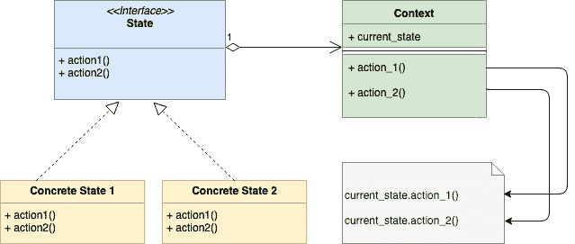

<!--yml
category: 未分类
date: 2024-10-13 06:01:16
-->

# State Design pattern in Go

> 来源：[https://golangbyexample.com/state-design-pattern-go/](https://golangbyexample.com/state-design-pattern-go/)

Note: Interested in understanding how all other design patterns can be implemented in GO. Please see this full reference – [All Design Patterns in Go (Golang)](https://golangbyexample.com/all-design-patterns-golang/)

Table of Contents

 **   [Definition:](#Definition "Definition:")
*   [When To Use](#When_To_Use "When To Use")
*   [UML Diagram](#UML_Diagram "UML Diagram")
*   [Mapping ](#Mapping "Mapping ")
*   [Explanation:](#Explanation "Explanation:")
*   [Practical Example:](#Practical_Example "Practical Example:")*  *## **Definition:**

State design pattern is a behavioral design pattern that is based on Finite State Machine. We will explain the State Design Pattern in the context of an example of a Vending Machine. For simplicity, let’s assume that vending machine only has one type of item or product. Also for simplicity lets assume that a Vending Machine can be in 4 different states

1.  **hasItem**
2.  **noItem**
3.  **itemRequested**
4.  **hasMoney**

A vending machine will also have different actions. Again for simplicity lets assume that there are only four actions:

1.  **Select the item**
2.  **Add the item**
3.  **Insert Money**
4.  **Dispense Item**

## **When To Use**

*   **Use the State design pattern when the object can be in many different states. Depending upon current request the object needs to change its current state**
    *   In the above example, Vending Machine can be in many different states. A Vending Machine will move from one state to another. Let’s say Vending Machine is in **itemRequested** then it will move to **hasMoney** state once the action “Insert Money” is done
*   Use when an object will have different responses to the same request depending upon the current state. Using state design pattern here will prevent a lot of conditional statements
    *   For example in the case of Vending Machine, if a user is want to purchase an item then the machine will proceed if it is **hasItemState** or it will reject if it is in **noItemState**. If you notice here that the Vending Machine on the request of purchase of an item gives two different responses depending upon whether it is in **hasItemState** or **noItemState.** Do notice the vendingMachine.go file below, it doesn’t have any kind of conditional statement. All the logic is being handled by concrete state implementations.

## **UML Diagram**



## **Mapping **

The below table represents the mapping from the UML diagram actors to actual implementation actors in code.

| Context | vendingMachine.go |
| State Interface | state.go |
| Concrete State 1 | noItemState.go |
| Concrete State 2 | hasItemState.go |
| Concrete State 3 | itemRequestedState.go |
| Concrete State 4 | hasMoneyState.go |

## **Explanation:**

*   We have an interface “State” which defines signatures of functions that represents action in the context of Vending Machine. Below are the actions function signatures
    1.  addItem(int) error
    2.  requestItem() error
    3.  insertMoney(money int) error
    4.  dispenseItem() error
*   Each of the concrete state implementations implements all 4 above function and either move to another state on these actions or gives some response.
*   Each of the concrete state also embeds a pointer to current Vending Machine object so that state transition can happen on that object.

Now lets look at code 

## **Practical Example:**

**vendingMachine.go**

```
package main

import "fmt"

type vendingMachine struct {
    hasItem       state
    itemRequested state
    hasMoney      state
    noItem        state

    currentState state

    itemCount int
    itemPrice int
}

func newVendingMachine(itemCount, itemPrice int) *vendingMachine {
    v := &vendingMachine{
        itemCount: itemCount,
        itemPrice: itemPrice,
    }
    hasItemState := &hasItemState{
        vendingMachine: v,
    }
    itemRequestedState := &itemRequestedState{
        vendingMachine: v,
    }
    hasMoneyState := &hasMoneyState{
        vendingMachine: v,
    }
    noItemState := &noItemState{
        vendingMachine: v,
    }

    v.setState(hasItemState)
    v.hasItem = hasItemState
    v.itemRequested = itemRequestedState
    v.hasMoney = hasMoneyState
    v.noItem = noItemState
    return v
}

func (v *vendingMachine) requestItem() error {
    return v.currentState.requestItem()
}

func (v *vendingMachine) addItem(count int) error {
    return v.currentState.addItem(count)
}

func (v *vendingMachine) insertMoney(money int) error {
    return v.currentState.insertMoney(money)
}

func (v *vendingMachine) dispenseItem() error {
    return v.currentState.dispenseItem()
}

func (v *vendingMachine) setState(s state) {
    v.currentState = s
}

func (v *vendingMachine) incrementItemCount(count int) {
    fmt.Printf("Adding %d items\n", count)
    v.itemCount = v.itemCount + count
}
```

**state.go**

```
package main

type state interface {
    addItem(int) error
    requestItem() error
    insertMoney(money int) error
    dispenseItem() error
}
```

**noItemState.go**

```
package main

import "fmt"

type noItemState struct {
    vendingMachine *vendingMachine
}

func (i *noItemState) requestItem() error {
    return fmt.Errorf("Item out of stock")
}

func (i *noItemState) addItem(count int) error {
    i.vendingMachine.incrementItemCount(count)
    i.vendingMachine.setState(i.vendingMachine.hasItem)
    return nil
}

func (i *noItemState) insertMoney(money int) error {
    return fmt.Errorf("Item out of stock")
}
func (i *noItemState) dispenseItem() error {
    return fmt.Errorf("Item out of stock")
}
```

**hasItemState.go**

```
package main

import "fmt"

type hasItemState struct {
    vendingMachine *vendingMachine
}

func (i *hasItemState) requestItem() error {
    if i.vendingMachine.itemCount == 0 {
        i.vendingMachine.setState(i.vendingMachine.noItem)
        return fmt.Errorf("No item present")
    }
    fmt.Printf("Item requestd\n")
    i.vendingMachine.setState(i.vendingMachine.itemRequested)
    return nil
}

func (i *hasItemState) addItem(count int) error {
    fmt.Printf("%d items added\n", count)
    i.vendingMachine.incrementItemCount(count)
    return nil
}

func (i *hasItemState) insertMoney(money int) error {
    return fmt.Errorf("Please select item first")
}
func (i *hasItemState) dispenseItem() error {
    return fmt.Errorf("Please select item first")
}
```

**itemRequestedState.go**

```
package main

import "fmt"

type itemRequestedState struct {
    vendingMachine *vendingMachine
}

func (i *itemRequestedState) requestItem() error {
    return fmt.Errorf("Item already requested")
}

func (i *itemRequestedState) addItem(count int) error {
    return fmt.Errorf("Item Dispense in progress")
}

func (i *itemRequestedState) insertMoney(money int) error {
    if money < i.vendingMachine.itemPrice {
        fmt.Errorf("Inserted money is less. Please insert %d", i.vendingMachine.itemPrice)
    }
    fmt.Println("Money entered is ok")
    i.vendingMachine.setState(i.vendingMachine.hasMoney)
    return nil
}

func (i *itemRequestedState) dispenseItem() error {
    return fmt.Errorf("Please insert money first")
}
```

**hasMoneyState.go**

```
package main

import "fmt"

type hasMoneyState struct {
    vendingMachine *vendingMachine
}

func (i *hasMoneyState) requestItem() error {
    return fmt.Errorf("Item dispense in progress")
}

func (i *hasMoneyState) addItem(count int) error {
    return fmt.Errorf("Item dispense in progress")
}

func (i *hasMoneyState) insertMoney(money int) error {
    return fmt.Errorf("Item out of stock")
}

func (i *hasMoneyState) dispenseItem() error {
    fmt.Println("Dispensing Item")
    i.vendingMachine.itemCount = i.vendingMachine.itemCount - 1
    if i.vendingMachine.itemCount == 0 {
        i.vendingMachine.setState(i.vendingMachine.noItem)
    } else {
        i.vendingMachine.setState(i.vendingMachine.hasItem)
    }
    return nil
}
```

**main.go**

```
package main

import (
    "fmt"
    "log"
)

func main() {
    vendingMachine := newVendingMachine(1, 10)
    err := vendingMachine.requestItem()
    if err != nil {
        log.Fatalf(err.Error())
    }
    err = vendingMachine.insertMoney(10)
    if err != nil {
        log.Fatalf(err.Error())
    }
    err = vendingMachine.dispenseItem()
    if err != nil {
        log.Fatalf(err.Error())
    }

    fmt.Println()
    err = vendingMachine.addItem(2)
    if err != nil {
        log.Fatalf(err.Error())
    }

    fmt.Println()

    err = vendingMachine.requestItem()
    if err != nil {
        log.Fatalf(err.Error())
    }

    err = vendingMachine.insertMoney(10)
    if err != nil {
        log.Fatalf(err.Error())
    }

    err = vendingMachine.dispenseItem()
    if err != nil {
        log.Fatalf(err.Error())
    }
}
```

**Output:**

```
Item requestd
Money entered is ok
Dispensing Item

Adding 2 items

Item requestd
Money entered is ok
Dispensing Item
```

*   [design](https://golangbyexample.com/tag/design/)*   [designpattern](https://golangbyexample.com/tag/designpattern/)*   [go](https://golangbyexample.com/tag/go/)*   [golang](https://golangbyexample.com/tag/golang/)*   [patter](https://golangbyexample.com/tag/patter/)*   [state](https://golangbyexample.com/tag/state/)*   [state design pattern](https://golangbyexample.com/tag/state-design-pattern/)*