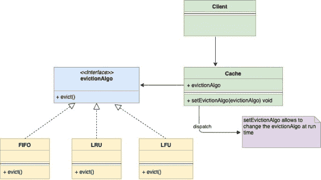

<!--yml
category: 未分类
date: 2024-10-13 06:02:48
-->

# Strategy Design Pattern in Go (Golang)

> 来源：[https://golangbyexample.com/strategy-design-pattern-golang/](https://golangbyexample.com/strategy-design-pattern-golang/)

Note: Interested in understanding how all other design patterns can be implemented in GO. Please see this full reference – [All Design Patterns in Go (Golang)](https://golangbyexample.com/all-design-patterns-golang/)

Table of Contents

 **   [Definition: ](#Definition "Definition:  ")
*   [When to Use](#When_to_Use "When to Use")
*   [UML Diagram](#UML_Diagram "UML Diagram")
*   [Mapping](#Mapping "Mapping")
*   [Practical Example](#Practical_Example "Practical Example ")*  *## **Definition: **

Strategy design pattern is a behavioral design pattern. This design pattern allows you to change the behavior of an object at run time without any change in the class of that object.

Let’s understand the strategy pattern with an example. Suppose you are building an In-Memory-Cache. Since it is an In-Memory-Cache it is of limited size. Whenever it reaches its maximum size that some old entries from the cache need to be evicted. This eviction can happen via several algorithms. Some of the popular algorithms are

1.  **LRU** – Least Recently Used: Remove the entry which has been used least recently.
2.  **FIFO** – First In First Out: Remove the entry, which was created first.
3.  **LFU** – Least Frequently Used: Remove the entry which was least frequently used.

Now the problem is how to decouple our Cache class with the algorithm such that we should be able to change the algorithm at run time. Also Cache class should not change when a new algorithm is being added. This is were Strategy Pattern comes into the picture. The strategy pattern suggests creating a family of the algorithm with each algorithm having its own class. Each of these classes follows the same interface and this makes the algorithm interchangeable within the family. Let’s say the common interface name is **evictionAlgo**.

Now our main **Cache** class will embed **evictionAlgo** interface. Instead of implementing all types of eviction algorithms in itself, our Cache class will delegate all it to the **evictionAlgo** interface. Since evictionAlgo is an interface, we can run time change the algorithm to either be LRU, FIFO, LFU without any change in Cache class.

## **When to Use**

*   When an object needs to support different behavior and you want to change the behavior at run time.
*   When you want to avoid a lot of conditionals of choosing the runtime behavior.
*   When you have different algorithms that are similar and they only differ in the way they execute some behavior.

## **UML Diagram**

Notice below UML diagram, Context (Cache) embeds the strategy (evictionAlgo) interface.

*   

Below is the corresponding mapping UML diagram with the example given above

*   

## **Mapping**

The below table represents the mapping from the UML diagram actors to actual implementation actors in code.

| Context | cache.go |
| Strategy | evictionAlgo.go |
| Concrete Strategy Object 1 | lfu.go |
| Concrete Strategy Object 2 | lru.go |
| Concrete Strategy Object 3 | fifo.go |
| Client | main.go |

## **Practical Example**

**evictionAlgo.go**

```
package main

type evictionAlgo interface {
    evict(c *cache)
}
```

**fifo.go**

```
package main

import "fmt"

type fifo struct {
}

func (l *fifo) evict(c *cache) {
    fmt.Println("Evicting by fifo strtegy")
}
```

**lru.go**

```
package main

import "fmt"

type lru struct {
}

func (l *lru) evict(c *cache) {
    fmt.Println("Evicting by lru strtegy")
}
```

**lfu.go**

```
package main

import "fmt"

type lfu struct {
}

func (l *lfu) evict(c *cache) {
    fmt.Println("Evicting by lfu strtegy")
}
```

**cache.go**

```
package main

type cache struct {
    storage      map[string]string
    evictionAlgo evictionAlgo
    capacity     int
    maxCapacity  int
}

func initCache(e evictionAlgo) *cache {
    storage := make(map[string]string)
    return &cache{
        storage:      storage,
        evictionAlgo: e,
        capacity:     0,
        maxCapacity:  2,
    }
}

func (c *cache) setEvictionAlgo(e evictionAlgo) {
    c.evictionAlgo = e
}

func (c *cache) add(key, value string) {
    if c.capacity == c.maxCapacity {
        c.evict()
    }
    c.capacity++
    c.storage[key] = value
}

func (c *cache) get(key string) {
    delete(c.storage, key)
}

func (c *cache) evict() {
    c.evictionAlgo.evict(c)
    c.capacity--
}
```

**main.go**

```
package main

func main() {
    lfu := &lfu{}
    cache := initCache(lfu)
    cache.add("a", "1")
    cache.add("b", "2")
    cache.add("c", "3")
    lru := &lru{}
    cache.setEvictionAlgo(lru)
    cache.add("d", "4")
    fifo := &fifo{}
    cache.setEvictionAlgo(fifo)
    cache.add("e", "5")
}
```

**Output:**

```
Evicting by lfu strtegy
Evicting by lru strtegy
Evicting by fifo strtegy
```

*   [design pattern](https://golangbyexample.com/tag/design-pattern/)*   [go](https://golangbyexample.com/tag/go/)*   [golang](https://golangbyexample.com/tag/golang/)*   [strategy design pattern](https://golangbyexample.com/tag/strategy-design-pattern/)*   [strategy design pattern in golang](https://golangbyexample.com/tag/strategy-design-pattern-in-golang/)*