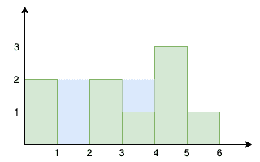

<!--yml
category: 未分类
date: 2024-10-13 06:44:10
-->

# Trapping rainwater problem in Go (Golang)

> 来源：[https://golangbyexample.com/trapping-rainwater-problem-golang/](https://golangbyexample.com/trapping-rainwater-problem-golang/)

Table of Contents

 **   [Overview](#Overview "Overview")
*   [Program](#Program "Program")*  *## **Overview**

There is a set of bars each of 1 unit width but different heights placed alongside. The height of the bars is represented using an array

```
[2, 0 , 2, 1, 3, 1]
```

The array represents that

*   The total number of bars is 5

*   The first bar is of height 2

*   The second bar is of height 0

*   The third bar is of height 2

*   The fourth bar is of height 1

*   The fifth bar is of height 3

*   The sixth bar is of height 1

The objective is to find the maximum amount of water that can be trapped within these bars



As seen from the above graph

*   2 units of water can be trapped between bar 1 and bar 3

*   1 unit of water can be trapped between bar 3 and bar 6

So total – 3 units of water can be trapped

Let’s see the program for the same. The strategy will be to use a stack.

*   Traverse through the given array

*   For the current element, keep popping from the stack until the stack is empty or the height of the top element is greater than the height of the current element.

*   For each popped element calculate the water that can be trapped between the popped element and the current element.

*   In the end, push the current element to the stack and the cycle repeats until all element in the array has been traversed

## **Program**

```
package main

import (
	"fmt"
	"sync"
)

func main() {
	output := trap([]int{2, 0, 2, 1, 3, 1})
	fmt.Println(output)

	output = trap([]int{0, 1, 0, 2, 1, 0, 1, 3, 2, 1, 2, 1})
	fmt.Println(output)

	output = trap([]int{4, 2, 0, 3, 2, 5})
	fmt.Println(output)
}

func trap(height []int) int {

	output := 0
	heightArrayLen := len(height)
	customStack := customStack{
		stack: make([]int, 0),
	}

	customStack.Push(0)

	for i := 1; i < heightArrayLen; i++ {

		for customStack.Size() != 0 {
			front, _ := customStack.Front()
			if height[front] <= height[i] {
				output = output + (i-front-1)*(height[front]-max(height, front+1, i-1))
				customStack.Pop()
			} else {
				output = output + (i-front-1)*(height[i]-max(height, front+1, i-1))
				break
			}
		}
		customStack.Push(i)
	}
	return output

}

func max(input []int, start, end int) int {

	if start > end {
		return 0
	}

	max := 0

	for i := start; i <= end; i++ {
		if input[i] > max {
			max = input[i]
		}
	}
	return max
}

type customStack struct {
	stack []int
	lock  sync.RWMutex
}

func (c *customStack) Push(name int) {
	c.lock.Lock()
	defer c.lock.Unlock()
	c.stack = append(c.stack, name)
}

func (c *customStack) Pop() error {
	len := len(c.stack)
	if len > 0 {
		c.lock.Lock()
		defer c.lock.Unlock()
		c.stack = c.stack[:len-1]
		return nil
	}
	return fmt.Errorf("Pop Error: Stack is empty")
}

func (c *customStack) Front() (int, error) {
	len := len(c.stack)
	if len > 0 {
		c.lock.Lock()
		defer c.lock.Unlock()
		return c.stack[len-1], nil
	}
	return 0, fmt.Errorf("Peep Error: Stack is empty")
}

func (c *customStack) Size() int {
	return len(c.stack)
}

func (c *customStack) Empty() bool {
	return len(c.stack) == 0
}
```

**Output**

```
3
6
9
```

**Note:** Check out our Golang Advanced Tutorial. The tutorials in this series are elaborative and we have tried to cover all concepts with examples. This tutorial is for those who are looking to gain expertise and a solid understanding of golang – [Golang Advance Tutorial](https://golangbyexample.com/golang-comprehensive-tutorial/)

Also if you are interested in understanding how all design patterns can be implemented in Golang. If yes, then this post is for you –[All Design Patterns Golang](https://golangbyexample.com/all-design-patterns-golang/)

*   [go](https://golangbyexample.com/tag/go/)*   [golang](https://golangbyexample.com/tag/golang/)*