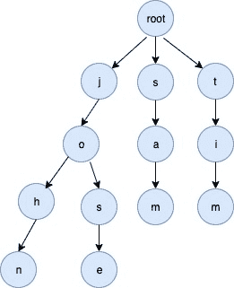

<!--yml
category: 未分类
date: 2024-10-13 06:06:33
-->

# Trie Implementation in Go (Golang)

> 来源：[https://golangbyexample.com/trie-implementation-in-go/](https://golangbyexample.com/trie-implementation-in-go/)

Table of Contents

 **   [Overview](#Overview "Overview")
*   [Full Working Code](#Full_Working_Code "Full Working Code")*  *# **Overview**

A trie is a data structure for efficient information retrieval. It is a special kind of tree where a path starting from root to a particular node can define a word that is stored in this tree. A trie can be built for entire ASCII_SIZE, ALPHABETS,  NUMBERS depending upon the use case. For, eg below will be the properties of a Trie data structure supporting small case alphabet letters

*   Each node has ALBHABET_SIZE=26 children. Each child node is a trie node itself and has ALBHABET_SIZE=26 children.

*   Each node is at an index in its parent’ children node array and represents an ASCII character. For eg for a particular node, the first non-nil children node will mean the presence of char ‘a’,  second non-nil children node means the presence of ‘b’ and so on. Absence of a child at an index means no value

*   Each node also has a boolean field indicating whether the node is the end of word or not

*   The root node is the starting node and has ALBHABET_SIZE=26 children. root is associated with an empty value

For eg for keywords [“sam”, “john”, “tim”, “jose”] below trie will be created



# **Full Working Code**

```
package main

import "fmt"

const (
   //ALBHABET_SIZE total characters in english alphabet
    ALBHABET_SIZE = 26
)

type trieNode struct {
    childrens [ALBHABET_SIZE]*trieNode
    isWordEnd bool
}

type trie struct {
    root *trieNode
}

func initTrie() *trie {
    return &trie{
        root: &trieNode{},
    }
}

func (t *trie) insert(word string) {
    wordLength := len(word)
    current := t.root
    for i := 0; i < wordLength; i++ {
        index := word[i] - 'a'
        if current.childrens[index] == nil {
            current.childrens[index] = &trieNode{}
        }
        current = current.childrens[index]
    }
    current.isWordEnd = true
}

func (t *trie) find(word string) bool {
    wordLength := len(word)
    current := t.root
    for i := 0; i < wordLength; i++ {
        index := word[i] - 'a'
        if current.childrens[index] == nil {
            return false
        }
        current = current.childrens[index]
    }
    if current.isWordEnd {
        return true
    }
    return false
}

func main() {
    trie := initTrie()
    words := []string{"sam", "john", "tim", "jose", "rose",
        "cat", "dog", "dogg", "roses"}
    for i := 0; i < len(words); i++ {
        trie.insert(words[i])
    }
    wordsToFind := []string{"sam", "john", "tim", "jose", "rose",
        "cat", "dog", "dogg", "roses", "rosess", "ans", "san"}
    for i := 0; i < len(wordsToFind); i++ {
        found := trie.find(wordsToFind[i])
        if found {
            fmt.Printf("Word \"%s\" found in trie\n", wordsToFind[i])
        } else {
            fmt.Printf("Word \"%s\" not found in trie\n", wordsToFind[i])
        }
    }
}
```

**Output:**

```
Word "sam" found in trie
Word "john" found in trie
Word "tim" found in trie
Word "jose" found in trie
Word "rose" found in trie
Word "cat" found in trie
Word "dog" found in trie
Word "dogg" found in trie
Word "roses" found in trie
Word "rosess" not found in trie
Word "ans" not found in trie
Word "san" not found in trie
```

*   [data structure](https://golangbyexample.com/tag/data-structure/)*   [trie](https://golangbyexample.com/tag/trie/)*