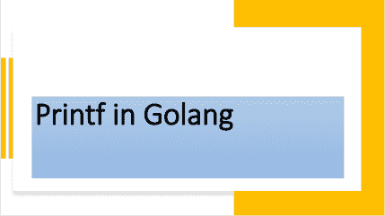

<!--yml
category: 未分类
date: 2024-10-13 06:37:45
-->

# Understanding Printf function in Go (Golang)

> 来源：[https://golangbyexample.com/printf-golang/](https://golangbyexample.com/printf-golang/)



Table of Contents

 **   [Overview](#Overview "Overview")
*   [Program](#Program "Program")*  *## **Overview**

**Printf** is defined in the **fmt** package and is used to format a string and write to standard output

[https://golang.org/pkg/fmt/#Printf](https://golang.org/pkg/fmt/#Printf)

Below is the function prototype of **Printf**

```
func Printf(format string, a ...interface{}) (n int, err error)
```

**Printf** formats the string using custom specifiers. It also doesn’t add a new line. **Printf** is also a variadic function meaning that it can have multiple arguments. There are two important points about its argument list

*   Notice that the first argument is a **format** or **template** string.

*   The next is a variable number of arguments. Each of the arguments in this list could be string, int, struct, or anything. That is why it is an empty interface

The **format** or **template** string contains the actual string that needs to be formatted plus some formating verbs. These formating verbs tell how the trailing arguments will be formatted in the final string.  So basically the format string argument contains certain symbols which are replaced by trailing arguments.  

Eg

**Printing a string variable**

*   **%s** symbol is used

*   Example 

```
name := "John"
fmt.Printf("Name is: %s\n", name)
```

**Printing an integer**

*   **%d** symbol is used

*   Example 

```
age := 21
fmt.Printf("Age is: %d\n", age)
```

**Printing a struct**

For example, there are three format specifiers for printing a struct. 

*   **%v** – It will print only values. The field name will not be printed. This is the default way of printing a struct when using Println

*   **%+v – **It will print both field and value. 

*   **%#v – **It will print the struct, also both field name and value

That is why

```
fmt.Printf("Employee is %v\n", e)
fmt.Printf("Employee is %+v\n", e)
fmt.Printf("Employee is %#v\n", e)
```

prints below respectively

```
Employee is {John 21}
Employee is {Name:John Age:21}
Employee is main.employee{Name:"John", Age:21}
```

It is as per the explanation above.

Also, note that this function returns the number of characters printed and any error if happens. Unlike **Println** it does add a new line. You will have to add **“\n”** explicitly. 

## Program

Here is the working program for the same

```
package main

import (
	"fmt"
	"log"
)

type employee struct {
	Name string
	Age  int
}

func main() {
	name := "John"
	age := 21

	fmt.Printf("Name is: %s\n", name)
	fmt.Printf("Age is: %d\n", age)

	fmt.Printf("Name: %s Age: %d\n", name, age)

	e := employee{
		Name: name,
		Age:  age,
	}

	fmt.Printf("Employee is %v\n", e)
	fmt.Printf("Employee is %+v\n", e)
	fmt.Printf("Employee is %#v\n", e)

	bytesPrinted, err := fmt.Printf("Name is: %s\n", name)
	if err != nil {
		log.Fatalln("Error occured", err)
	}
	fmt.Println(bytesPrinted)
}
```

**Output**

```
Name is: John
Age is: 21
Name: John Age: 21
Employee is {John 21}
Employee is {Name:John Age:21}
Employee is main.employee{Name:"John", Age:21}
Name is: John
14
```

Notice that in below **Printf**

```
fmt.Printf("Name: %s Age: %d\n", name, age)
```

*   **%s** is replaced by name.

*   **%d** is replaced by age.

So basically the symbols or verbs in the format string argument are replaced by trailing arguments in order

If the number of format specifiers in the format string does not match the number of next variable arguments then the format specifier will be printed as is. For example, in the below code, we have two format specifier

*   %d

*   %s

While the next variable number of arguments is only one. Hence when we print it then it will print the second format specifier as is with MISSING as a warning

```
package main
import "fmt"
type employee struct {
    Name string
    Age  int
}
func main() {
    name := "John"
    fmt.Printf("Name is: %s %d\n", name)
}
```

**Output**

```
Name is: John %!d(MISSING)
```

Also, check out our Golang advance tutorial Series – [Golang Advance Tutorial](https://golangbyexample.com/golang-comprehensive-tutorial/)*