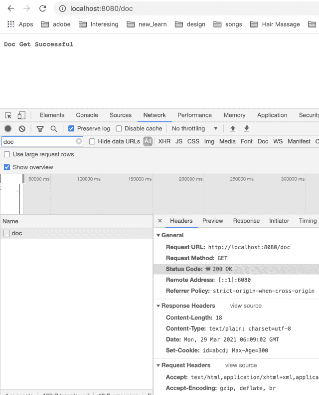

<!--yml
category: 未分类
date: 2024-10-13 06:34:34
-->

# Understanding Set-Cookie Response Header

> 来源：[https://golangbyexample.com/set-cookie-response-header/](https://golangbyexample.com/set-cookie-response-header/)

Table of Contents

 **   [Overview of Set-Cookie Response Header](#Overview_of_Set-Cookie_Response_Header "Overview of Set-Cookie Response Header")
*   [Examples](#Examples "Examples")
*   [Program](#Program "Program")*  *# **Overview of Set-Cookie Response Header**

The web server can send the Set-Cookie header back to the client or browsers or any other user agent. The client is then supposed to store this cookie at its end. This client will send this cookie to the server on each request.

You can read about HTTP cookie in general here – [https://en.wikipedia.org/wiki/HTTP_cookie](https://en.wikipedia.org/wiki/HTTP_cookie)

Below is the syntax of the Set-Cookie header

```
Set-Cookie: <cookie_name>=<cookie_value>; Expires={some_date}; Max-Age={some_integer}; Domain={some_domain}; Path={some_path}; 
SameSite={Strict/Lax/None}</cookie_value></cookie_name>
```

Below are the fields of the Set-Cookie header. These fields are joined by **‘;’** to create the final Set-Cookie header value

*   **name=value** – This is the name-value pair that denotes the <cookie-name> and <cookie-value>. Name and Value separated by **‘=’**.  This is a mandatory field of a cookie. All other fields are optional fields

*   **Expires={some_date}** – It specifies the max lifetime of a cookie. It is in date format and the cookie will expire after that. 

*   **Max-Age={some_integer}** – it represents the number of seconds after which the cookie will expire. Max-Age has precedence if both Expires and Max-Date is specified

*   **Domain={some_domain}** – It specifies the domain to which the request will be sent

*   **Path={some_path}** – The path to exist in the requested URI for the client to send the cookies. If the path does not match the requested URI, the client will not send the cookie. The higher level path matches the lower level path.  Hence / will match all paths. While /employee will match /employee, /employee/name, /employee/details

*   **Secure** – This flag means that cookie will only be sent to the server if an HTTPS request is made

*   **HttpOnly** – With this flag on,  javascript will not be able to access the cookie. This is to prevent CSRF attacks

*   **SameSite**=**Strict** or **Lax** or **None** – This option controls whether the cookies can be sent when the browser makes a cross-origin call. 

As mentioned above these fields can be combined using **‘;’** to create the final Set-Cookie header.  An important thing to note here is that the client will only send the name-value pair back to the server for subsequent calls to the server. All other options are for client only. Other important point to note is that server can also send multiple **Set-Cookie** header in the response. All the name-value pair in all the Set-Cookie response header will be send to the server in subsequent calls.

# **Examples**

Here are some samples of Set-Cookie header

*   Only name-value pair

```
show_pop=true
```

*   name-value pair with Expires field

```
show_pop=true; Expires=Tues, 27 Nov 2016 07:45:00 GMT
```

*   name-value pair with other fields

```
show_pop=true; Expires=Tues, 27 Nov 2016 07:45:00 GMT; Domain=foo_test.com; SameSite=Strict
```

# **Program**

Let’s see the **Set-Cookie** header in action.  We will see the example in golang. For that first create a golang server listening on port 8080\. Create two APIs

*   **localhost:8080/doc** – In this API the server will set the **Set-Cookie** header in the response. We are going to make this call from the browser. The browser is going to save this cookie at its end. The browser will then send the same cookie back to the server for any other request to localhost:8080

*   **localhost:8080/doc/id** – This is the example API to demonstrate that browser actually sends the same cookie in request which in received in response in the Set-Cookie header

Let’s first create a server

**go.mod**

```
module sample.com/learn

go 1.16
```

**main.go**

```
package main

import (
	"fmt"
	"net/http"
)

func main() {
	docHandler := http.HandlerFunc(docHandler)
	http.Handle("/doc", docHandler)

	docGetID := http.HandlerFunc(docGetID)
	http.Handle("/doc/id", docGetID)

	http.ListenAndServe(":8080", nil)
}

func docHandler(w http.ResponseWriter, r *http.Request) {
	cookie := &http.Cookie{
		Name:   "id",
		Value:  "abcd",
		MaxAge: 300,
	}
	http.SetCookie(w, cookie)
	w.WriteHeader(200)
	w.Write([]byte("Doc Get Successful"))
	return
}

func docGetID(w http.ResponseWriter, r *http.Request) {
	c, _ := r.Cookie("id")
	fmt.Println(c)
	w.WriteHeader(200)
	w.Write([]byte("Doc Get ID Successful"))
	return
}
```

See in the above code we have two APIs as discussed above. Run the above program using

```
go run main.go
```

The server will start running  on port 8080

Now make the API call **localhost:8080/doc** from a browser. The server is sending below **Set-Cookie** in the response

```
Set-Cookie: id=abcd; Max-Age=300
```

Same is also visible in the response headers of the API call. See screenshot below



Now let’s make the other API call from a different tab.  Notice that same cookie is send back in the response. Also note that only name-value pair is send back as we mentioned above in the article


Checkout our Golang comprehensive tutorial Series – [Golang Comprehensive Tutorial](https://golangbyexample.com/golang-comprehensive-tutorial/)*