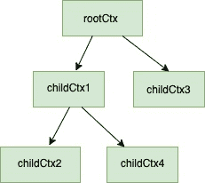

<!--yml
category: 未分类
date: 2024-10-13 06:05:57
-->

# Using Context Package in GO (Golang) – Complete Guide

> 来源：[https://golangbyexample.com/using-context-in-golang-complete-guide/](https://golangbyexample.com/using-context-in-golang-complete-guide/)

# **Introduction**:

## **Definition:**

Context is a package provided by GO. Let’s first understand some problems that existed already, and which context package tries to solve.

## **Problem Statement:**

*   Let’s say that you started a function and you need to pass some common parameters to the downstream functions. You cannot pass these common parameters each as an argument to all the downstream functions.

*   You started a goroutine which in turn start more goroutines and so on. Suppose the task that you were doing is no longer needed. Then how to inform all child goroutines to gracefully exit so that resources can be freed up

*   A task should be finished within a specified timeout of say 2 seconds. If not it should gracefully exit or return.

*   A task should be finished within a deadline eg it should end before 5 pm . If not finished then it should gracefully exit and return

If you notice all the above problems are quite applicable to HTTP requests and but none the less these problems are also applicable to many different areas too.

For a web HTTP request, it needs to be canceled when the client has disconnected, or the request has to be finished within a specified timeout and also requests scope values such as request_id needs to be available to all downstream functions.

## **When to Use (Some Use Cases):**

*   To pass data to the downstream. Eg.  a HTTP request creates a **request_id, request_user** which needs to be passed around to all downstream functions for distributed tracing.

*   When you want to halt the operation in the midway – A HTTP request should be stopped because the client disconnected

*   When you want to halt the operation within a specified time from start i.e with timeout – Eg- a HTTP request should be completed in 2 sec or else should be aborted.

*   When you want to halt an operation before a certain time – Eg. A cron is running that needs to be aborted in 5 mins if not completed.

# **Context Interface**

The core of the understanding context is knowing the **Context** interface

```
type Context interface {
    //It retures a channel when a context is cancelled, timesout (either when deadline is reached or timeout time has finished)
    Done() <-chan struct{}

    //Err will tell why this context was cancelled. A context is cancelled in three scenarios.
    // 1\. With explicit cancellation signal
    // 2\. Timeout is reached
    // 3\. Deadline is reached
    Err() error

    //Used for handling deallines and timeouts
    Deadline() (deadline time.Time, ok bool)

    //Used for passing request scope values
    Value(key interface{}) interface{}
}
```

# **Creating New Context**

## **context.Background():**

context package function Background() returns a empty Context which implements the **Context** interface

1.  It has no values
2.  It is never canceled
3.  It has no deadline

Then what is the use context.Background(). context.Background() serves as the root of all context which will be derived from it. It will be more clear as we go along

## **context.ToDo():**

*   context package ToDo function returns an empty Context. This context is used when the surrounding function has not been passed a context and one wants to use the context as a placeholder in the current function and plans to add actual context in the near future. One use of adding it as a placeholder is that it helps in validation in the Static Code Analysis tool.

*   It is also an empty Context same as context.Background()

The above two methods describe a way of creating new contexts. More context can be derived from these contexts. This is where context tree comes into the picture

# **Context Tree**

Before understanding Context Tree please make sure that it is implicitly created in the background when using **context**. You will find no mention of in go context package itself.

Whenever you use context, then the empty Context got from context.Background() is the root of all context. context.ToDo() also acts like root context but as mentioned above it is more like a context placeholder for future use. This empty context has no functionality at all and we can add functionality by deriving a new context from this. Basically a new context is created by wrapping an already existing immutable context and adding additional information. Let's see some example of a context tree which gets created

**Two level tree**

```
rootCtx := context.Background()
childCtx := context.WithValue(rootCtx, "msgId", "someMsgId")
```

In above

*   **rootCtx** is the empty Context with no functionality

*   **childCtx** is derived from rootCtx and has the functionality of storing request-scoped values. In above example it is storing key-value pair of  {"msgId" : "someMsgId"}

**Three level tree**

```
rootCtx := context.Background()
childCtx := context.WithValue(rootCtx, "msgId", "someMsgId")
childOfChildCtx, cancelFunc := context.WithCancel(childCtx)
```

In above

*   **rootCtx** is the empty Context with no functionality

*   **childCtx** is derived from rootCtx and has the functionality of storing request-scoped values. In above example it is storing key-value pair of  {"msgId" : "someMsgId"}

*   **childOfChildCtx** is derived from childCtx . It has the functionality of storing request-scoped values and also it has the functionality of triggering cancellation signals. cancelFunc can be used to trigger cancellation signals

**Multi-level tree**

```
rootCtx := context.Background()
childCtx1 := context.WithValue(rootCtx, "msgId", "someMsgId")
childCtx2, cancelFunc := context.WithCancel(childCtx1)
childCtx3 := context.WithValue(rootCtx, "user_id", "some_user_id)
```

In above:

*   **rootCtx** is the empty Context with no functionality

*   **childCtx1** is derived from **rootCtx** and has the functionality of storing request-scoped values. In above example it is storing key-value pair of  {"msgId" : "someMsgId"}

*   **childCtx2** is derived from **childCtx1** . It has the functionality of triggering cancellation signals. cancelFunc can be used to trigger cancellation signals

*   **childCtx3** is derived from **rootCtx** . It has the functionality of storing the current user

Above three-level tree would look like below


As since it is a tree, it is also possible to create more childs for a particular node. For eg we can derive a new context **childCtx4** from **childCtx1**

```
childCtx4 := context.WithValue(childCtx1, "current_time", "some_time)
```

Tree with above node added would like below:



At this very moment, it might not be clear how WithValue() or WithCancel() function is used. Right now just understand that whenever using context, a context tree is created with root as the **emptyCtx** . These functions will get clear as we move on

# **Deriving From Context**

A derived context is can be created in 4 ways

*   Passing request-scoped values  -  using **WithValue()** function of context package

*   With cancellation signals - using **WithCancel()** function of context package

*   With deadlines - using **WithDeadine()** function of context package

*   With timeouts - using **WithTimeout()** function of context package

Let's understand each of the above in details

## **context.WithValue()**

Used for passing request-scoped values. The complete signature of the function is

```
withValue(parent Context, key, val interface{}) (ctx Context)
```

It takes in a parent context, key, value and returns a derived context  This derived context has **key** associated with the **value**. Here the parent context can be either context.Background() or any other context. Further, any context which is derived from this context will have this value.

```
#Root Context
ctxRoot := context.Background() - #Root context 

#Below ctxChild has acess to only one pair {"a":"x"}
ctxChild := context.WithValue(ctxRoot, "a", "x") 

#Below ctxChildofChild has access to both pairs {"a":"x", "b":"y"} as it is derived from ctxChild
ctxChildofChild := context.WithValue(ctxChild, "b", "y") 
```

**Example:**

Complete Working example of **withValue().** In the below example, we are injecting a msgId for each incoming request. If you notice in below program

*   inejctMsgID is a net HTTP middleware function that populates the **"msgID"** field in context

*   HelloWorld is the handler function for api "localhost:8080/welcome" which gets this msgID from context and sends it back as response headers

```
package main

import (
    "context"
    "net/http"
    "github.com/google/uuid"
)

func main() {
    helloWorldHandler := http.HandlerFunc(HelloWorld)
    http.Handle("/welcome", inejctMsgID(helloWorldHandler))
    http.ListenAndServe(":8080", nil)
}

//HelloWorld hellow world handler
func HelloWorld(w http.ResponseWriter, r *http.Request) {
    msgID := ""
    if m := r.Context().Value("msgId"); m != nil {
        if value, ok := m.(string); ok {
            msgID = value
        }
    }
    w.Header().Add("msgId", msgID)
    w.Write([]byte("Hello, world"))
}

func inejctMsgID(next http.Handler) http.Handler {
    return http.HandlerFunc(func(w http.ResponseWriter, r *http.Request) {
        msgID := uuid.New().String()
        ctx := context.WithValue(r.Context(), "msgId", msgID)
        req := r.WithContext(ctx)
        next.ServeHTTP(w, req)

    })
}
```

Simply do a curl call to the above request after running the above program

```
curl -v http://localhost/welcome
```

Here will be the response. Notice the **MsgId** that gets populated in the response headers. The injectMsgId function acts as middleware and injects a unique msgId to the request context.

```
curl -v http://localhost:8080/welcome
*   Trying ::1...
* TCP_NODELAY set
* Connected to localhost (::1) port 8080 (#0)
> GET /do HTTP/1.1
> Host: localhost:8080
> User-Agent: curl/7.54.0
> Accept: */*
> 
< HTTP/1.1 200 OK
< Msgid: a03ff1d4-1464-42e5-a0a8-743c5af29837
< Date: Mon, 23 Dec 2019 16:51:01 GMT
< Content-Length: 12
< Content-Type: text/plain; charset=utf-8
< 
* Connection #0 to host localhost left intact
```

## **context.WithCancel()**

Used for cancellation signals. Below is the signature of **WithCancel()** function

```
func WithCancel(parent Context) (ctx Context, cancel CancelFunc)
```

**context.WithCancel()** function returns two things

*   Copy of the parentContext with the new done channel.

*   A cancel function which when called closes this done channel

Only the creator of this context should call the cancel function. It is highly not recommended to pass around the **cancel** function. Lets understand **withCancel** with an example.

**Example:**

```
package main

import (
    "context"
    "fmt"
    "time"
)

func main() {
    ctx := context.Background()
    cancelCtx, cancelFunc := context.WithCancel(ctx)
    go task(cancelCtx)
    time.Sleep(time.Second * 3)
    cancelFunc()
    time.Sleep(time.Second * 1)
}

func task(ctx context.Context) {
    i := 1
    for {
        select {
        case <-ctx.Done():
            fmt.Println("Gracefully exit")
            fmt.Println(ctx.Err())
            return
        default:
            fmt.Println(i)
            time.Sleep(time.Second * 1)
            i++
        }
    }
}
```

**Output:**

```
1
2
3
Gracefully exit
context canceled
```

In the above program

*   task function will gracefully exit once the **cancelFunc** is called. Once the cancelFunc is called, the error string is set to **"context cancelled"** by the context package. That is why the output of **ctx.Err()** is **"context cancelled"**

## **context.WithTimeout()**

Used for time-based cancellation. The signature of the function is

```
func WithTimeout(parent Context, timeout time.Duration) (Context, CancelFunc)
```

**context.WithTimeout()** function  will

*   Will return a copy of the parentContext with the new done channel.

*   Accept a timeout duration after which this done channel will be closed and context will be canceled

*   A cancel function which can be called in case the context needs to be canceled before timeout.  

Lets see an example

**Example:**

```
package main

import (
    "context"
    "fmt"
    "time"
)

func main() {
    ctx := context.Background()
    cancelCtx, cancel := context.WithTimeout(ctx, time.Second*3)
    defer cancel()
    go task1(cancelCtx)
    time.Sleep(time.Second * 4)
}

func task1(ctx context.Context) {
    i := 1
    for {
        select {
        case <-ctx.Done():
            fmt.Println("Gracefully exit")
            fmt.Println(ctx.Err())
            return
        default:
            fmt.Println(i)
            time.Sleep(time.Second * 1)
            i++
        }
    }
}
```

**Output:**

```
1
2
3
Gracefully exit
context deadline exceeded
```

In the above program

*   task function will gracefully exit once the timeout of 3 seconds is completed. The error string is set to "context deadline exceeded" by the context package. That is why the output of ctx.Err() is "context deadline exceeded"

## **context.WithDeadline()**

Used for deadline-based cancellation. The signature of the function is

```
func WithDeadline(parent Context, d time.Time) (Context, CancelFunc)
```

**context.WithDeadline()** function

*   Will return a copy of the parentContext with the new done channel.

*   Accept a deadline after which this done channel will be closed and context will be canceled

*   A cancel function which can be called in case the context needs to be canceled before the deadline is reached.

Let's see an example

**Example:**

```
package main

import (
    "context"
    "fmt"
    "time"
)

func main() {
    ctx := context.Background()
    cancelCtx, cancel := context.WithDeadline(ctx, time.Now().Add(time.Second*5))
    defer cancel()
    go task(cancelCtx)
    time.Sleep(time.Second * 6)
}

func task(ctx context.Context) {
    i := 1
    for {
        select {
        case <-ctx.Done():
            fmt.Println("Gracefully exit")
            fmt.Println(ctx.Err())
            return
        default:
            fmt.Println(i)
            time.Sleep(time.Second * 1)
            i++
        }
    }
}
```

**Output:**

```
1
2
3
4
5
Gracefully exit
context deadline exceeded
```

In the above program

*   task function will gracefully exit once the timeout of 5 seconds is completed as we gave the deadline of Time.now() + 5 seconds. The error string is set to "context deadline exceeded" by the context package. That is why the output of ctx.Err() is "context deadline exceeded"

# **What We Learned**

**How to create the context**:

*   Using context.Backgroun()

*   Using context.Todo()

**Context Tree**

**Deriving a new context**

*   context.WithValue()

*   context.WithCancel()

*   context.WithTimeout()

*   contxt.WithDeadline()

# **BestPractices and Caveats**

Following is a list of best practices that you can follow while using a context.

*   Do not store a context within a struct type

*   Context should flow through your program. For example, in case of an HTTP request, a new context can be created for each incoming request which can be used to hold a request_id or put some common information in the context like currently logged in user which might be useful for that particular request.

*   Always pass context as the first argument to a function.

*   Whenever you are not sure whether to use the context or not, it is better to use the context.ToDo() as a placeholder.

*   Only the parent goroutine or function should the cancel context. Therefore do not pass the **cancelFunc** to downstream goroutines or functions. Golang will allow you to pass the **cancelFunc** around to child goroutines but it is not a recommended practice

*   [context in golang](https://golangbyexample.com/tag/context-in-golang/)*   [explained](https://golangbyexample.com/tag/explained/)*   [golang context explained](https://golangbyexample.com/tag/golang-context-explained/)*   [sidetoc](https://golangbyexample.com/tag/sidetoc/)